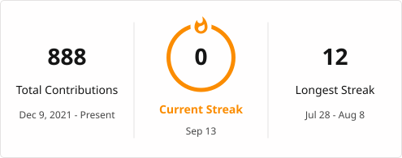

# Nur

**AI Products & Platform Builder**

> I build platforms, productize AI, and ship the occasional universe.

`platforms · ai products · games & systems`

  
  
  
  

---

## About

I'm **Nur** — an engineer who turns ideas into working systems, products, and stories. My work spans full platforms, AI-assisted products, and games, held together by a curiosity for the details underneath. I care about how systems behave *internally*, not just how to use them — then I use that understanding to build the next layer on top.

---

## Featured work

| project | pillar | stack | link |
| ------- | ------ | ----- | ---- |
| **Ocaty** — modular e-commerce platform | platforms | TypeScript · React · Module Federation · FastAPI · PostgreSQL | private |
| **Tony** — self-hosted AI assistant | ai products | Letta · React · Activepieces · TypeScript | [repo](https://github.com/NurHabibAssolihudin/Tony) |
| **Oxelot** — low-level PWA native-bridge | ai products | TypeScript · WASM · Workers · OPFS | [repo](https://github.com/NurHabibAssolihudin/Oxelot) |
| **GenUI** — AI-configurable dashboard | ai products | Python · FastAPI · Jinja2 · LLM | [repo](https://github.com/NurHabibAssolihudin/GenUI) |
| **Backtrade CLI** — crypto backtesting | systems | Python · Rich · Questionary | [repo](https://github.com/NurHabibAssolihudin/ZeroGrowth_Backtrade) |
| **RabbitMQ-Chat-App** — realtime chat | systems | Python · FastAPI · RabbitMQ · WebSocket | [repo](https://github.com/NurHabibAssolihudin/RabbitMQ-Chat-App) |
| **alimagine** — games & narrative | games | Godot · GDScript · Narrative | [org](https://github.com/alimagine) |

---

## Stack

**Languages**

  
  
  
  

**Backend & AI**

  
  
  
  

**Frontend & Platforms**

  
  
  
  
  

**Data & Infra**

  
  
  
  

**Tooling**

  
  
  
  

**Games**

  
  

---

## GitHub

<picture>
  <source media="(prefers-color-scheme: dark)" srcset="./profile/streak-dark.svg" />
  <source media="(prefers-color-scheme: light)" srcset="./profile/streak-light.svg" />
  
</picture>

<picture>
  <source media="(prefers-color-scheme: dark)" srcset="./profile/top-langs-dark.svg" />
  <source media="(prefers-color-scheme: light)" srcset="./profile/top-langs-light.svg" />
  
</picture>

---

## Philosophy

1. **Ship, then understand deeper** — plans are great, but shipping is where you learn what the system actually demands.
2. **Productize AI, don't wrap it** — the value isn't a prompt box; it's turning models into products with real memory, real actions, real interfaces.
3. **Prefer internals over abstractions** — abstractions are easier to learn, internals are easier to debug. I want both, in that order.
4. **Make it observable before fast** — if you can't see what a system is doing, you can't make it reliable, let alone fast.

---

## Contact

| channel | where |
| ------- | ----- |
| Email | [nurhabibassolihudin12@gmail.com](mailto:nurhabibassolihudin12@gmail.com) |
| GitHub | [github.com/NurHabibAssolihudin](https://github.com/NurHabibAssolihudin) |
| LinkedIn | [linkedin.com/in/nurhabib-assolihudin](https://linkedin.com/in/nurhabib-assolihudin) |
| Portfolio | [nurhabibassolihudin.github.io](https://nurhabibassolihudin.github.io) |

`platforms · ai · games — built with curiosity`

